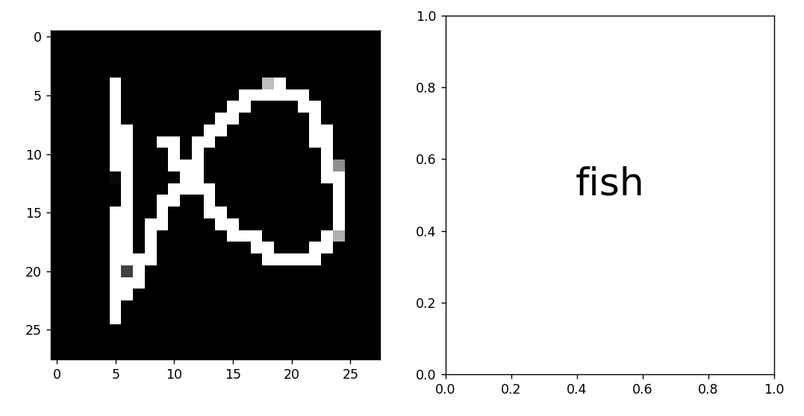

# AI Pictionary



A game based introduction to image classification.

## Install

```commandline
git clone https://github.com/RobertJN64/AI_Pictionary_Server
pip install tensorflow
pip install flask
pip install matplotlib
```

## Training
Download datasets from: https://console.cloud.google.com/storage/browser/quickdraw_dataset/full/numpy_bitmap
and place in a folder named `qd_files` next to [train.py](train.py). Fill the [train.json](train.json) file with a list
of the images you want to train on (see example file).

Run [train.py](train.py) - it will ask if you want to use the dashboard. If you want more
detailed training data, install [MLDashboard](https://github.com/RobertJN64/MLDashboard)
and type `y`, otherwise type `n`.

Training will save your model into `models/new/qd_model`. You can rename the `new` folder to
whatever you want.

## Server
Set the model name you chose in [ai.py](ai.py#L28) Run the server by running [main.py](main.py). It will launch the webserver using flask
and load up the display (matplotlib). Go to the IP printed in the console, and interact with
the model by drawing in the box provided. You can connect using another device on the 
same network.